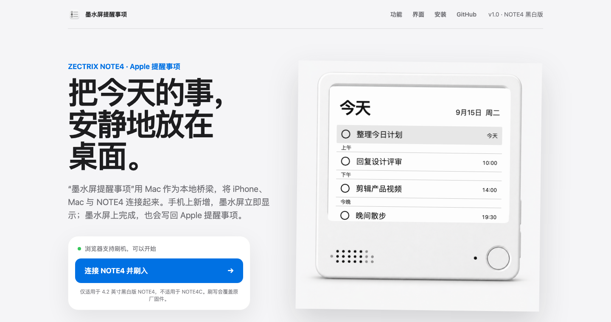
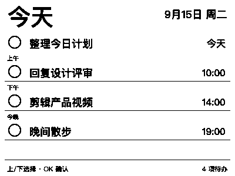
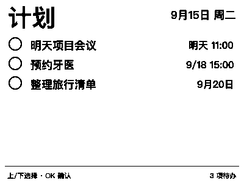
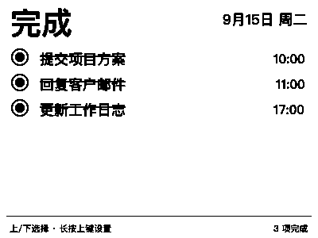
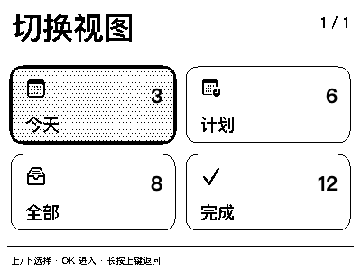

  
  <h1>墨水屏提醒事项</h1>
  
<strong>让 ZECTRIX NOTE4 完全联动 Apple 提醒事项、Mac 与 iPhone。</strong>

  

    <a href="https://wegooo-cell.github.io/EInkReminders/"><strong>浏览器刷机</strong></a>
    ·
    <a href="https://github.com/wegooo-cell/EInkReminders/releases/tag/v1.0.0"><strong>下载 v1.0.0</strong></a>
    ·
    <a href="docs/user-manual.md"><strong>中文说明书</strong></a>
  

  

    
    
    
    
  

## 项目是什么

“墨水屏提醒事项”不是另一套独立的待办系统。它以 **Mac App 作为本地桥梁**，继续使用
Apple“提醒事项”里的真实数据：

- 在 iPhone 或 Mac 新增、修改、完成事项，NOTE4 会自动更新。
- 在 NOTE4 上选择事项并按 OK，完成状态会写回 Mac，再经 iCloud 同步到 iPhone。
- NOTE4 不需要登录 iCloud，不保存 Apple ID 或密码。
- 提醒事项数据和设备操作只在 Apple 生态与家庭局域网之间流转。

当前版本仅适用于 **ZECTRIX NOTE4 4.2 英寸黑白版**，不支持 NOTE4C。

## 系统怎样联动

  <table>
    <tr>
      <td align="center"><strong>iPhone / iPad</strong> Apple 提醒事项</td>
      <td align="center">⇄ iCloud</td>
      <td align="center"><strong>Mac</strong> 本地同步桥梁</td>
      <td align="center">⇄ 家庭局域网</td>
      <td align="center"><strong>ZECTRIX NOTE4</strong> 查看与完成</td>
    </tr>
  </table>

Mac App 通过系统 EventKit 权限读取用户选中的提醒事项列表。Apple 提醒事项发生变化后，
应用会立即重新同步当前视图；30 秒、1 分钟、10 分钟、30 分钟或 1 小时的周期同步用于
网络中断后的补偿。

## NOTE4 界面预览

以下画面直接由当前 Mac 渲染器生成，均为 NOTE4 原生 **400 × 300、1-bit 黑白位图**。

<table>
  <tr>
    <td width="50%">
      
       <strong>今天</strong> 
      无日期事项默认属于今天；具体时间按上午、下午、今晚分段。
    </td>
    <td width="50%">
      
       <strong>计划</strong> 
      显示所有设置了日期的未完成事项，正确区分明天和未来日期。
    </td>
  </tr>
  <tr>
    <td width="50%">
      
       <strong>完成</strong> 
      集中查看已完成项目，每页最多显示六项。
    </td>
    <td width="50%">
      
       <strong>切换视图</strong> 
      长按上键进入设置，在今天、计划、全部、完成之间切换。
    </td>
  </tr>
</table>

## 核心功能

| 功能 | 行为 |
| --- | --- |
| Apple 生态双向同步 | iPhone 与 Mac 的修改显示到 NOTE4；NOTE4 的完成操作写回 Apple 提醒事项 |
| 四种智能视图 | 今天、计划、全部、完成，数据逻辑跟随 macOS 提醒事项 |
| 硬件按键操作 | 上键选择上一项，下键选择下一项，OK 完成，长按上键进入设置 |
| 本地即时反馈 | 按 OK 后立即显示实心圆和删除线，不需要等待 Mac 返回 |
| 连续完成多项 | 每次操作分别写入设备队列，可以连续完成第二项、第三项 |
| 到点提醒 | 屏幕中央显示提醒卡片；选择完成，或延后 5 分钟 |
| 中文扫码配网 | 首次启动显示 Wi-Fi 二维码；iPhone 扫码后从附近 Wi-Fi 列表选择网络 |
| 手机控制页面 | 在同一局域网访问 NOTE4 IP，可切换视图、同步、刷新和管理网络 |
| 局部刷新 | 选择移动等小范围变化局部刷新，累计 8 次后自动全刷清理残影 |
| 清晰文字 | Mac 端高分辨率渲染后转换为 1-bit，减少中文笔画锯齿 |
| 离线操作队列 | 断网时先保存完成操作，Mac 成功写回并确认后才从设备队列清除 |

### 视图规则

- **今天**：显示无日期、逾期和日期为今天的未完成事项；具体时间按上午、下午、今晚分组。
- **计划**：显示所有设置了日期的未完成事项，按日期和时间排列。
- **全部**：显示所选列表中的全部未完成事项，不设应用层项目上限。
- **完成**：显示已完成事项，最近完成的内容排在前面。

今天、计划和完成视图最多同步并浏览 20 项；全部视图同步当前列表里的全部未完成事项。
跨过当前可见窗口时，Mac 会按需为 NOTE4 生成下一幅画面。

### 完成事项的反馈

1. 在 NOTE4 上按 OK。
2. 设备立即将空心圆变成内含实心圆的状态，并为标题添加删除线。
3. 操作先保存到 NOTE4 Flash，再等待 Mac 拉取。
4. Mac 通过 EventKit 将对应 Apple 提醒事项标记为完成。
5. 约 5 秒后 NOTE4 同步刷新，已完成项目从当前未完成视图移除。

如果事项是在 Mac 或 iPhone 上完成，NOTE4 会在下一次同步时直接移除，不额外显示本地确认动画。

## 快速安装

### 方式一：浏览器刷机

1. 在电脑端 Chrome 或 Edge 打开 [公开刷机页面](https://wegooo-cell.github.io/EInkReminders/)。
2. 使用支持数据传输的 USB 线连接 NOTE4。
3. 点击“连接 NOTE4 并刷入”，选择设备串口。
4. 等待写入和校验完成，中途不要拔掉 USB。
5. 重启后用 iPhone 扫描 NOTE4 上的配网二维码。
6. 加入 <code>EInk-Note4-XXXX</code> 热点，从中文页面选择家庭 2.4 GHz Wi-Fi。

> 刷机会覆盖 NOTE4 原厂固件。请先确认设备是黑白版 NOTE4，而不是 NOTE4C。

### 方式二：ESP-IDF 编译

要求 ESP-IDF 5.4 或更高版本：

    cd firmware-note4
    idf.py set-target esp32s3
    idf.py build
    idf.py -p /dev/cu.usbmodemXXXX flash monitor

## 安装 Mac App

| 下载内容 | 地址 |
| --- | --- |
| macOS App v1.0.0 | [EInkReminders-macOS-v1.0.0.zip](https://github.com/wegooo-cell/EInkReminders/releases/download/v1.0.0/EInkReminders-macOS-v1.0.0.zip) |
| NOTE4 完整固件 v1.0.0 | [eink-reminders-note4-v1.0.0.bin](https://github.com/wegooo-cell/EInkReminders/releases/download/v1.0.0/eink-reminders-note4-v1.0.0.bin) |
| SHA-256 校验文件 | [SHA256SUMS-v1.0.0.txt](https://github.com/wegooo-cell/EInkReminders/releases/download/v1.0.0/SHA256SUMS-v1.0.0.txt) |

Mac App 要求 macOS 13 或更高版本。首次打开：

1. 按系统提示授权访问“提醒事项”和本地网络。
2. 输入 NOTE4 屏幕显示的局域网地址，例如 <code>http://192.168.1.42</code>。
3. 选择需要同步的 Apple 提醒事项列表。
4. 开启自动同步，点击“立即同步”。

Release 中的应用使用 ad-hoc 本地签名。若 macOS 阻止首次启动，可在 Finder 中右键应用，
选择“打开”，再确认一次。

从源码构建：

    cd macOS
    swift test
    ./build-app.sh
    open build/墨水屏提醒事项.app

## 首次配网

NOTE4 没有保存 Wi-Fi，或无法连接原网络时，会建立 <code>EInk-Note4-XXXX</code> 热点并显示二维码。

1. 用 iPhone 相机扫描屏幕二维码并加入设备热点。
2. 中文配网页面通常会自动弹出；未弹出时访问 <code>http://192.168.4.1</code>。
3. 从扫描结果中选择家庭 2.4 GHz Wi-Fi。
4. 输入密码并连接；固件验证成功后才保存配置。
5. 记录 NOTE4 获得的局域网 IP，并填入 Mac App。

需要恢复原网络时，可长按上键进入“设置 → Wi-Fi 与网络 → 重连 Wi-Fi”；只有更换网络时
才需要选择“重新配网”。

设备已经保存 Wi-Fi 后，即使网络暂时断开，也会保留当前待办画面并每 10 秒后台重连，
不会自动返回扫码页。若当前正停留在扫码页，也可以长按上键进入设置。

## 项目目录

    firmware-note4/       ESP-IDF / ZECTRIX NOTE4 固件
    macOS/                SwiftUI + EventKit macOS 同步应用
    web-flasher-note4/    GitHub Pages 浏览器刷机与产品介绍页
    docs/                 使用说明、通信协议和硬件说明
    release/              v1.0.0 固件、Mac App 与校验文件

进一步阅读：

- [完整中文说明书](docs/user-manual.md)
- [NOTE4 固件说明](docs/zectrix-note4.md)
- [局域网同步协议](docs/protocol.md)
- [v1.0.0 发布说明](RELEASE_NOTES_v1.0.0.md)
- [浏览器刷机页](https://wegooo-cell.github.io/EInkReminders/)

## 数据与安全

- Apple 提醒事项由 Mac 通过系统 EventKit 授权读取。
- NOTE4 不保存 Apple ID 或 iCloud 密码。
- Mac 与 NOTE4 使用家庭局域网 HTTP 通信。
- 当前版本尚未加入设备配对密钥或 HMAC，请勿把 NOTE4 的 80 端口映射到公网。
- 当前版本不主动传播删除操作，以减少原型阶段误删数据的风险。
- Mac 必须保持开机并运行同步应用；NOTE4 不能脱离 Mac 直接访问 iCloud。

## 开源与第三方代码

仓库目前公开提供源码。项目根目录的再发布许可证尚待作者确定；在许可证确定前，请勿假设
拥有复制、修改或再发布本项目原创代码的授权。NOTE4 固件中沿用的上游与第三方代码许可见：

- [firmware-note4/LICENSE](firmware-note4/LICENSE)
- [firmware-note4/THIRD_PARTY_NOTICES.md](firmware-note4/THIRD_PARTY_NOTICES.md)
