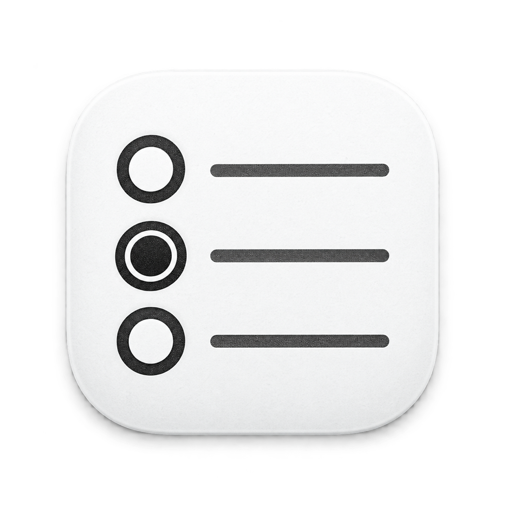

# 墨水屏提醒事项



**v1.0.0：让黑白墨水屏完全联动 Apple 生态。**

“墨水屏提醒事项”以 macOS 应用作为本地桥梁，将 Apple 提醒事项与黑白墨水屏双向同步。
你可以在 Mac 或 iPhone 上新增、修改和完成事项，也可以直接在墨水屏上确认完成，结果会写回
Apple 提醒事项并经 iCloud 同步到其他 Apple 设备。

当前版本仅支持 ZECTRIX NOTE4 黑白版。

## 核心亮点

- **完全联动 Apple 生态**：共用 Apple 提醒事项中的真实数据，不建立封闭的第二套待办系统。
- **Mac 与 iPhone 自动同步**：iPhone 上的变化经 iCloud 到达 Mac 后，Mac App 会立即刷新墨水屏。
- **墨水屏反向完成**：在 NOTE4 按 OK 完成事项，Mac App 会写回 Apple 提醒事项。
- **隐私优先**：同步发生在家庭局域网内；设备不需要登录 iCloud，也不保存 Apple ID 密码。
- **开箱即用**：提供中文浏览器刷机、iPhone 扫码配网、手机控制页和黑白墨水屏专用界面。

## 立即使用

- [打开 NOTE4 中文浏览器刷机页](https://eink-reminders-note4-flasher.coldcolo.chatgpt.site/)
- [查看完整中文说明书](docs/user-manual.md)
- [查看 v1.0.0 发布说明](RELEASE_NOTES_v1.0.0.md)

## 硬件基线

- ZECTRIX NOTE4 黑白版
- ESP32-S3
- 4.2 英寸 400 × 300 SSD2683 黑白墨水屏
- 上键、下键和 OK 键

不支持 NOTE4C 彩色版或其他 ESP32 墨水屏组合。

## v1.0 行为

- Mac 通过 EventKit 读取一个 Apple Reminders 列表。
- Mac 监听 EventKit 变更；Mac 本地或 iPhone 经 iCloud 传来的提醒事项变化会立即触发当前视图同步，周期同步仅作为补偿。
- Mac 将提醒事项渲染为 NOTE4 原生 400 × 300 的 1-bit 位图并推送到设备。
- NOTE4 暴露局域网网页，可由手机进行设备设置。
- NOTE4 上键选择上一项、下键选择下一项、OK 单击确认完成；上下选择均首尾循环。
- NOTE4 长按上键进入设置，可切换“今天、计划、全部、完成”四个视图。
- NOTE4 空视图显示“目前没有事项”；仅“今天”视图中当天事项都已完成时显示“都忙完了玩去吧”。
- NOTE4 新视图默认不显示选中背景；第一次按上、下或 OK 只显示选中项，30 秒无按键后自动隐藏。
- NOTE4 的选中移动等小范围变化使用局部刷新，累计 8 次后自动全刷以控制残影。
- NOTE4 为保证文字清晰会省略标题中的 Emoji，Apple“提醒事项”里的原始标题保持不变。
- NOTE4 只缓存当前选择画面和确认预览；按键移动时由 Mac 按需生成下一幅画面。今天、计划和完成视图最多浏览 20 项，全部视图不设应用层项目上限。
- 主屏采用 Apple Reminders 风格的六项纯文字列表。“今天”视图按上午、下午、今晚分组；“计划”和“全部”保持日期时间顺序，明天及更晚的事项显示对应日期与时间，不会被当天时段过滤。
- Mac 或 iPhone 完成的事项在下次同步刷新时直接移除。只有从墨水屏确认的事项，才会在本次同步后紧跟在所有可见待办下面，以圆圈内实心圆和标题删除线显示一次，并在下一次同步刷新时移除。
- NOTE4 将离线操作保存在 flash，Mac 拉取并写回 Apple Reminders。

> 当前版本不会从 Apple Reminders 执行删除，以避免原型阶段误删数据。

完整的安装、添加事项、按键操作和故障排查请参阅 [`docs/user-manual.md`](docs/user-manual.md)。

## 目录

```text
firmware-note4/  ESP-IDF 5.4+ / ZECTRIX NOTE4 固件
macOS/     Swift Package 形式的 macOS SwiftUI 菜单栏应用
docs/      通信协议与实现说明
web-flasher-note4/ Chrome / Edge NOTE4 浏览器刷机页
```

## 编译固件

固件使用 ESP-IDF 5.4 或更高版本：

```bash
cd firmware-note4
idf.py set-target esp32s3
idf.py build
idf.py -p /dev/cu.usbmodemXXXX flash monitor
```

NOTE4 首次上电或 Wi-Fi 连接失败时会建立 `EInk-Note4-XXXX` 热点并显示动态
Wi-Fi 二维码。用 iPhone 相机扫码加入热点后，中文配网页面会自动打开；未弹出时访问
`http://192.168.4.1`。Mac 应用会自动识别其 400 × 300 屏幕格式，无需切换模式。

也可以在电脑端 Chrome 或 Edge 中使用浏览器刷机页，无需安装 ESP-IDF：

```bash
cd web-flasher-note4
python3 -m http.server 4184 --directory dist
```

然后访问 `http://localhost:4184`，用 USB 数据线连接设备并点击“连接并刷入”。

## 安装 macOS 应用

要求 macOS 13+、Xcode 15+：

```bash
cd macOS
swift test
./build-app.sh
open build/墨水屏提醒事项.app
```

首次启动授权“提醒事项”，输入设备显示的 IP，例如 `http://192.168.1.42`，然后同步。
v1.0 Release 中的本地构建使用 ad-hoc 签名，无需 Apple 开发者签名验证；首次运行仍需按系统要求授权“提醒事项”和局域网访问。系统权限变化后，可能需要在“系统设置 → 隐私与安全性 → 提醒事项”中重新授权。

## 已知边界

- NOTE4 的按键选择使用局部刷新，累计一定次数后自动全刷以控制残影。提醒事项变化会立即触发同步；Mac 的 30 秒、1 分钟、10 分钟、30 分钟或 1 小时周期同步用于断线补偿。
- EventKit 的本地 identifier 可能在完整 iCloud 同步后改变，因此协议另存稳定 `syncId`。当前 MVP
  以 identifier 加内容指纹恢复映射，正式版应增加持久化映射库。
- Mac 必须在线并保持运行；设备不能直接访问 iCloud Reminders。
- MVP 的 HTTP 接口只适用于可信家庭局域网，尚未加入配对密钥/HMAC；不要把设备 80 端口暴露到公网。
